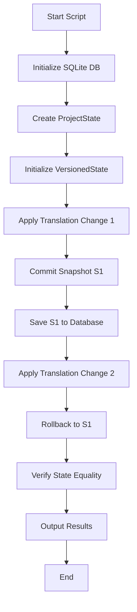

# Exercise

Spine Harness

## Overview

Create a minimal harness script in `scripts/exercise-spine.ts` that exercises the complete Catty Trans workflow without UI. The script will demonstrate the full data flow from project creation through rollback operations.

## Architecture Flow




## Implementation Details

### 1. Script Structure (`scripts/exercise-spine.ts`)

The script will:

- Import core-domain functions: `applyTranslationChange`, `commitSnapshot`, `rollbackToSnapshot`
- Import adapter: `saveSnapshot`, `loadProjectState` from `sqlite-project-snapshot-adapter`
- Create a Database wrapper around better-sqlite3
- Execute the full workflow sequence
- Output state comparisons and execution flow

### 2. Database Setup

- Use `better-sqlite3` (will need to add as devDependency)
- Create in-memory database for temporary execution
- Initialize schema using `schema-projects-snapshots.sql`
- Wrap better-sqlite3 Database instance to match the `Database` interface from the adapter

### 3. Project Creation

Construct initial `ProjectState` using domain types:

- Create `Project` with:
- `id`: Branded ProjectId
- `clientId`: Branded ClientId  
- `name`: "Exercise Test Project"
- `sourceLanguage`: "en"
- `targetLanguages`: ["fr"]
- `status`: "in_progress"
- Create `Segment` with:
- `id`: Branded SegmentId
- `projectId`: matches project.id
- `indexWithinProject`: 0
- `sourceText`: "Hello world"
- `sourceLanguage`: "en"
- `isLocked`: false
- Initialize empty `targetSegments` array
- Create `VersionedState` with empty `HistoryGraph`

### 4. Workflow Execution

**Step 1: Apply First Change**

- Create `TranslationChange` for segment 0, target language "fr"
- Apply using `applyTranslationChange` to get new `ProjectState`
- Update `VersionedState.currentState`

**Step 2: Commit Snapshot S1**

- Generate `SnapshotId` (e.g., "snapshot-1")
- Use `commitSnapshot` to create snapshot in history
- Use `saveSnapshot` adapter to persist to database
- Capture state for later comparison

**Step 3: Apply Second Change**

- Create another `TranslationChange` (different text/status)
- Apply change to current state
- Update `VersionedState.currentState`

**Step 4: Rollback to S1**

- Call `rollbackToSnapshot` with S1's snapshot ID
- Verify `currentState` matches S1's state exactly

### 5. Output Format

The script will output:

- Execution flow summary
- State before rollback (currentState after change 2)
- State after rollback (should match S1)
- Verification results (state equality check)

### 6. Dependencies

Add to `package.json`:

- `better-sqlite3`: SQLite database driver
- `@types/better-sqlite3`: TypeScript types (if needed)

### 7. Type Branding Helper

Create a simple helper function to cast strings to branded types (similar to test fixtures but for the harness).

## Files to Create/Modify

1. **Create**: `scripts/exercise-spine.ts` - Main harness script
2. **Modify**: `package.json` - Add better-sqlite3 dependency and script entry
3. **Create**: `scripts/db-wrapper.ts` - Database interface wrapper (optional, can be inline)

## Key Constraints

- Use only public interfaces from `core-domain` and `adapters`
- No direct SQLite access (only through adapter)
- All domain logic must go through core-domain functions
- Maintain immutability guarantees (no state mutation)
- Use branded types correctly (ProjectId, SegmentId, etc.)

## Expected Output Example

```javascript
=== Catty Trans Spine Exercise ===

1. Created project: Exercise Test Project (en -> fr)
2. Applied change 1: "Bonjour" (translated)
3. Committed snapshot S1
4. Applied change 2: "Bonjour le monde" (approved)
5. Rolled back to snapshot S1

State before rollback:
  Segment 0: "Bonjour le monde" (approved)

State after rollback:
  Segment 0: "Bonjour" (translated)

Verification: ✓ States match S1 exactly
```


## Testing the Harness

The script should be executable via:

```bash
npm run exercise-spine
# or
npx ts-node scripts/exercise-spine.ts


```