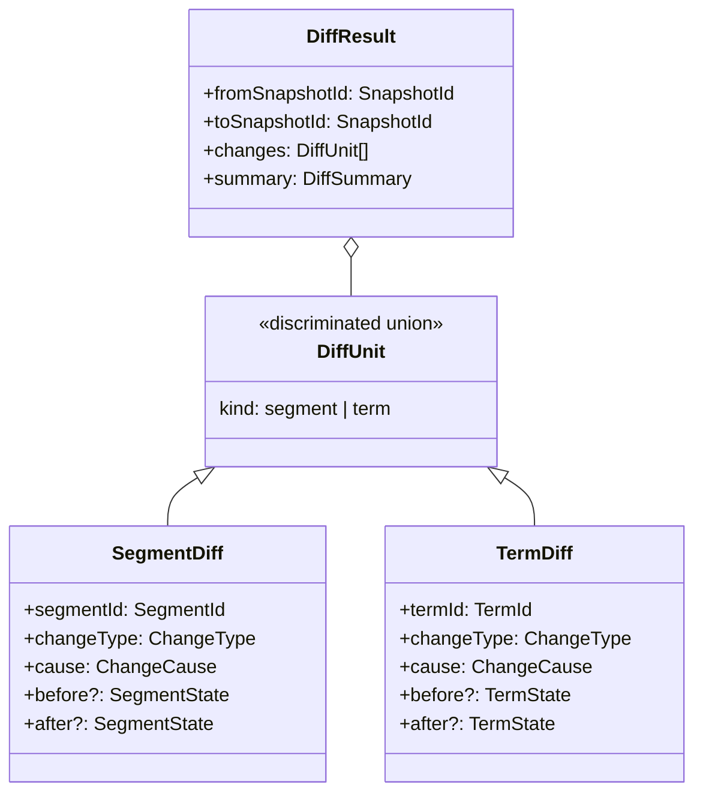

# Linguistic Diff Domain Model

## Overview

Refactor [`core-domain/diff/diff-types.ts`](core-domain/diff/diff-types.ts) to define a linguistic diff model that explains **what changed semantically** between two project states. The model captures change causation (manual edit, TM insert, unknown) and references snapshot provenance for auditability.---

## Key Design Decisions

### What a Diff Must Always Explain

1. **Before state** - the segment/term value prior to change (text, status, language)
2. **After state** - the segment/term value after change (text, status, language)
3. **Snapshot provenance** - which snapshots are being compared (`fromSnapshotId`, `toSnapshotId`)
4. **Change cause** - how the change occurred: `manual_edit`, `tm_insert`, or `unknown`
5. **What entity changed** - segment or term (via `DiffUnit` discriminated union)
6. **Change type** - `created`, `modified`, `deleted`, or `unchanged`

### What a Diff Must Never Guess

1. **TM involvement** - if no explicit TM provenance exists, cause is `unknown`, not inferred
2. **Character-level edits** - no Myers diff, no inline insertions/deletions
3. **User intent** - no "typo fix" or "style change" classifications
4. **Temporal ordering** - snapshots have IDs, not assumed chronology
5. **Missing provenance** - if `fromSnapshotId` or `toSnapshotId` is unavailable, the diff is invalid

---

## Type Definitions

### File: [`core-domain/diff/diff-types.ts`](core-domain/diff/diff-types.ts) (update existing)

**Types to add/replace:**| Type | Purpose ||------|---------|| `ChangeCause` | Union: `'manual_edit' \| 'tm_insert' \| 'unknown'` || `ChangeType` | Union: `'created' \| 'modified' \| 'deleted' \| 'unchanged'` (exists, extract) || `SegmentState` | Before/after snapshot of segment translation state || `TermId` | Branded placeholder for future terminology domain || `TermState` | Placeholder for term before/after state || `SegmentDiff` | Diff for a single segment with cause and states || `TermDiff` | Placeholder diff for a single term || `DiffUnit` | Discriminated union: `{ kind: 'segment' } & SegmentDiff \| { kind: 'term' } & TermDiff` || `DiffResult` | Refactor to use `SnapshotId` refs instead of full `ProjectState` |---

## Changes to Existing File

1. **Keep**: Module header comment, architecture constraint
2. **Extract**: `ChangeType` as standalone union (currently inline in `DiffEntry`)
3. **Add**: `ChangeCause`, `SegmentState`, `TermId`, `TermState`, `SegmentDiff`, `TermDiff`, `DiffUnit`
4. **Refactor**: `DiffResult` to reference `SnapshotId` instead of full `ProjectState`
5. **Deprecate**: `DiffEntry` (replaced by `SegmentDiff`)
6. **Keep**: Function stubs (`computeDiff`, `filterDiffByChangeType`, `explainDiff`) with updated signatures

---

## Diff Responsibilities (Summary)