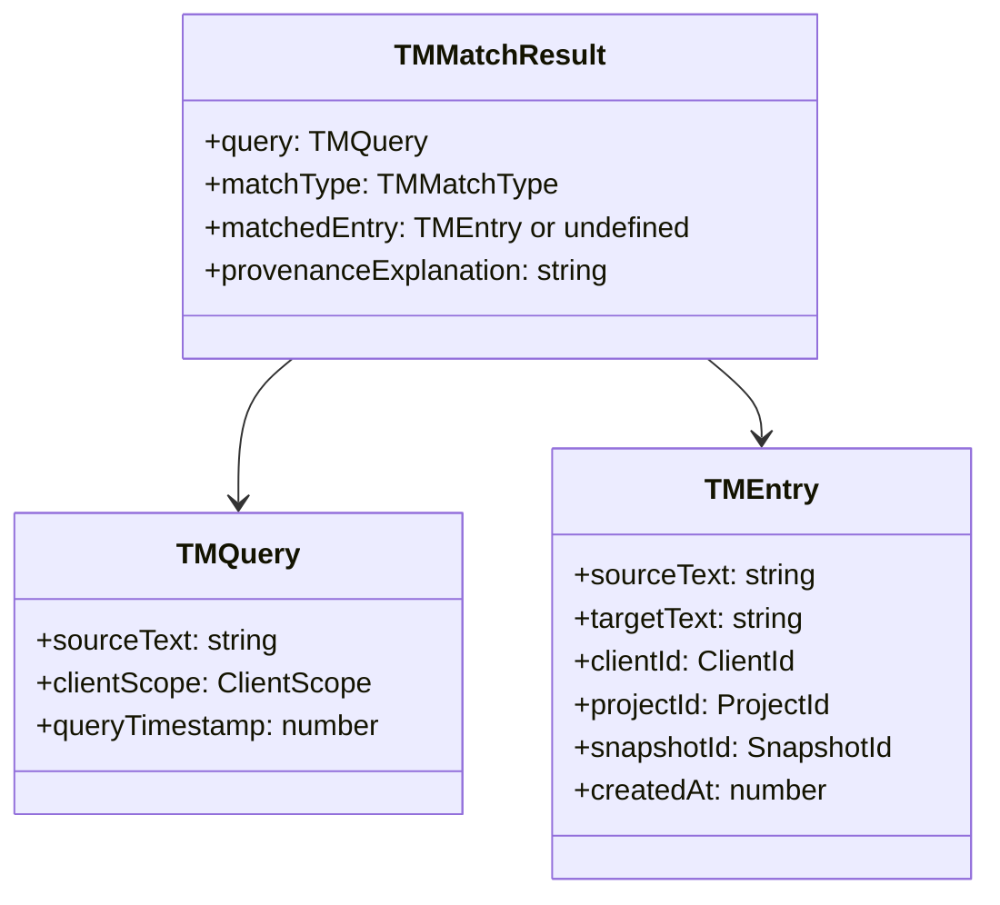

# TM Query Semantics Definition

## Context

The PRD explicitly requires auditability for client disputes (Job 5: "Audit what changed and why") and inspectability of system decisions. The existing [`tm-types.ts`](core-domain/tm/tm-types.ts) already defines `TMEntry` with complete provenance (`projectId`, `snapshotId`, `createdAt`), and [`promotion-guard.ts`](core-domain/tm/promotion-guard.ts) demonstrates the pattern of returning decisions with human-readable `reason` fields.

## Design Decisions

### Match Types: Exact vs None Only

No fuzzy matching or scoring. This is intentional:

- Eliminates probabilistic behaviour that could produce different results on repeated queries
- Removes ranking ambiguity (no "which 85% match is better?" disputes)
- Aligns with PRD requirement for inspectable, deterministic decisions

### Provenance Explanation Format

The `provenanceExplanation` field will be a human-readable string that answers: "Why did this match occur, and where did it come from?" This supports the PRD scenario where a translator must prove what TM match was available at translation time.

## Type Design

### How This Supports Client Disputes

When a client disputes wording, the translator can:

1. Re-run the exact same `TMQuery` against the TM state from that point in time
2. Receive identical `TMMatchResult` (determinism guarantee)
3. Show the `provenanceExplanation` which includes:

- The project that contributed the matched entry
- The snapshot it came from
- The timestamp of entry creation

4. Prove whether they followed TM guidance or made a justified deviation

## File to Create

[`core-domain/tm/query-types.ts`](core-domain/tm/query-types.ts) (note: kebab-case per coding standards, not camelCase as suggested in the task)

## Implementation Notes